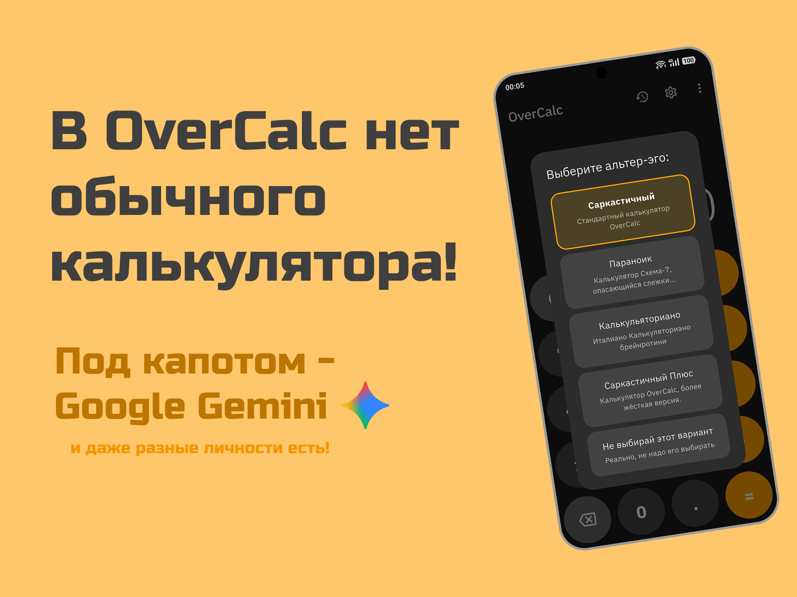
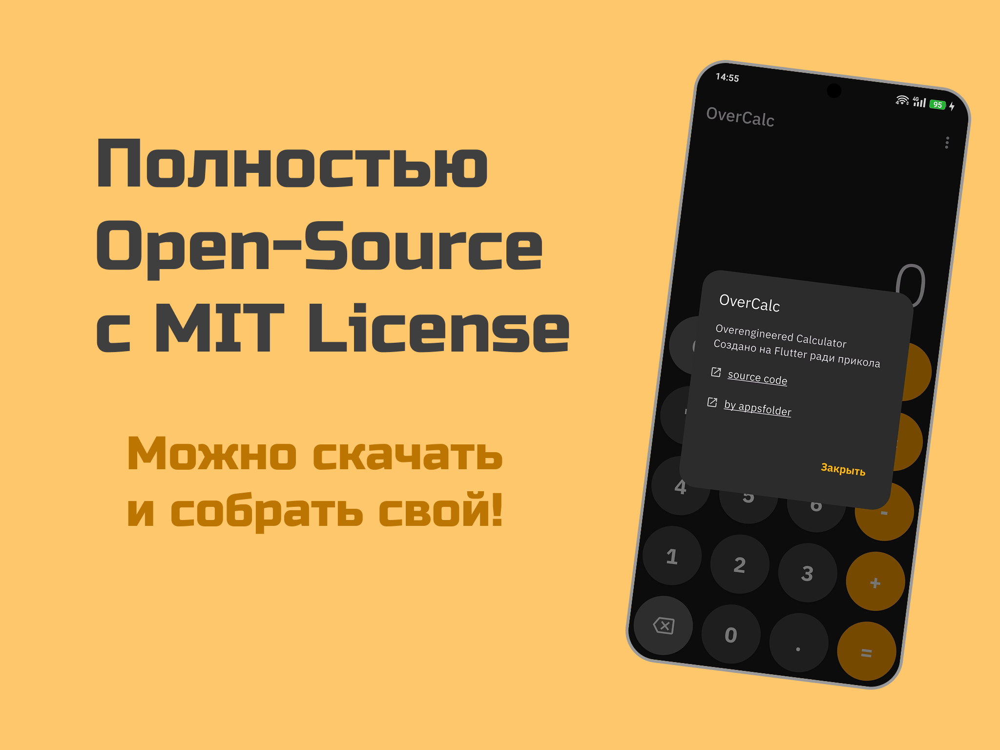
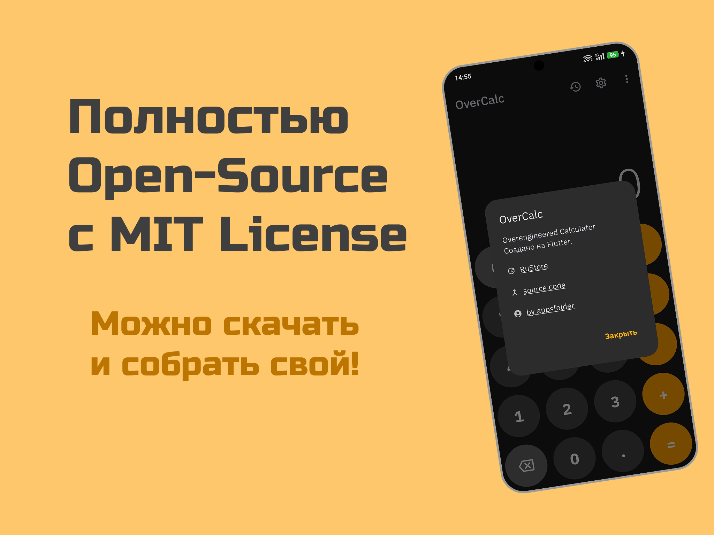

# OverCalc

[](https://opensource.org/licenses/MIT)
[](https://flutter.dev)
[](https://github.com/appsfolder/OverCalc)

**OverCalc — это не просто калькулятор. Это полный бред вместо калькулятора, построенный на Flutter и работающий на мощностях Google Gemini AI.**

Он выглядит как обычный калькулятор, но под капотом скрывается LLM с разными альтер-эго — от саркастичного до параноидального, что превращает математические расчеты в безумие.


<a href="https://play.google.com/store/apps/details?id=com.appsfolder.overcalc" target="_blank">
  </a><span style="display:inline-block;width:8px;"></span><a href="https://www.rustore.ru/catalog/app/com.appsfolder.overcalc?utm_source=available_in_rustore&utm_medium=com.appsfolder.overcalc&rsm=1&mt_link_id=iios36&mt_sub1=com.appsfolder.overcalc" target="_blank"></a>

&nbsp;


## Особенности

*   **Внутри - Google Gemini:** Все вычисления обрабатываются нейросетью Google Gemini, что позволяет ему работать абсолютно иначе относительно классических калькуляторов.
*   **Сменные "личности":** Устали от скучных цифр? Переключитесь на другого AI-персонажа с уникальным стилем ответов и своей историей.
*   **Классический UI/UX:** Привычный UI/UX калькулятора, но не дайте ему вас обмануть!
*   **Адаптивные иконки:** Поддержка Material You (Monet) и классических иконок для идеального вида на любом устройстве Android.
*   **Пользовательский API ключ:** Возможность для пользователей добавить свой собственный Gemini API ключ для безлимитного использования.
*   **Тактильная отдача:** Приятный виброотклик при нажатии на кнопки для более реалистичных ощущений.



## Стек технологий

*   **Фреймворк:** [Flutter](https://flutter.dev/)
*   **Язык:** [Dart](https://dart.dev/)
*   **AI:** [Google Gemini API](https://ai.google.dev/)
*   **Пакеты:**
    *   `http` - для запросов к Gemini API
    *   `auto_size_text` - для адаптивного текста на дисплее
    *   `flutter_secure_storage` - для хранения API ключа пользователя, истории, и настроек
    *   `url_launcher` - для открытия внешних ссылок
    *   `flutter_native_splash` & `flutter_launcher_icons` - для брендинга
    *   `showcaseview` - для помощи новым пользователям





## Как запустить проект

### Пререквизиты

Убедитесь, что у вас установлен [Flutter SDK](https://docs.flutter.dev/get-started/install).

### Установка

1.  **Клонируйте репозиторий:**
    ```bash
    git clone https://github.com/appsfolder/OverCalc.git
    cd OverCalc
    ```

2.  **Создайте `.env` файл:**
    Вам нужен API ключ для Gemini. Его можно получить в [Google AI Studio](https://aistudio.google.com/app/apikey).

    В корневой папке проекта создайте файл с именем `.env` (вы можете скопировать `.env.example`) и добавьте в него ваш ключ:
    ```
    GEMINI_API_KEY=ВАШ_СУПЕР_СЕКРЕТНЫЙ_API_КЛЮЧ
    PROXY_SERVER_URL="https://example.com/api/request"
    DEFAULT_MODEL_NAME="gemini-2.5-flash"
    ```

3.  **Установите зависимости:**
    ```bash
    flutter pub get
    ```

4.  **Сгенерируйте иконки и сплэш-скрин (если необходимо):**
    ```bash
    flutter pub run flutter_launcher_icons
    flutter pub run flutter_native_splash:create
    ```

5.  **Запустите приложение:**
    ```bash
    flutter run
    ```

## Хотите помочь?

Проект всегда открыт для новых Issues и Pull requests! Если у вас есть идеи по улучшению, вы придумали новую "личность" для калькулятора или нашли баг, пожалуйста, создайте [Issue](https://github.com/appsfolder/OverCalc/issues) или сделайте Pull Request.

1.  Сделайте форк проекта.
2.  Создайте новую ветку (`git checkout -b feature/NewFeature`).
3.  Закоммитьте ваши изменения (`git commit -m 'Add some NewFeature'`).
4.  Отправьте изменения в вашу ветку (`git push origin feature/NewFeature`).
5.  Откройте Pull Request.

## Лицензия

Этот проект распространяется под лицензией MIT. Смотрите файл `LICENSE` для подробностей.

---

Сделано с ❤️ от [@appsfolder](https://github.com/appsfolder)
